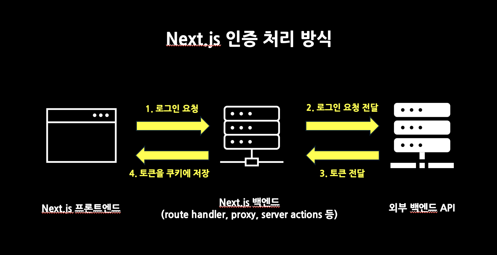
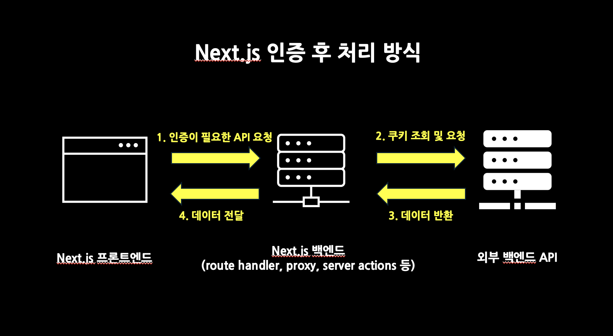

# Storage

- Cookie, Web Storage(Local Storage, Session Storage...)

## 웹 브라우저 저장소의 장점

1. 사용자 경험 향상: 이전 상태 기억
2. 서버 부담 감소: 요청 횟수, DB 저장 공간
3. 특정 상황에 적합:
   - 비로그인 사용자의 장바구니
   - 팝업 표시 여부 등 사용자 선호도 저장
   - 자주 접근하는 데이터 캐싱 등 성능 최적화

## 각 저장소의 특성 구분

- 쿠키와 웹 스토리지의 차이
  1. 쿠키는 하나당 최대 4KB(사이트당 약 20개), 웹 스토리지는 도메인 당 5~10MB(브라우저마다 상이)
  2. 쿠키는 모든 HTTP 요청에 자동으로 포함되어 서버로 전송되나 웹 스토리지는 그렇지 않음
  3. 쿠키는 만료일을 설정할 수 있지만 `localStorage`는 영구적이며, `sessionStorage`는 세션 종료 시 삭제됨
  4. 쿠키는 보안 옵션 설정 가능(`HttpOnly`,`Secure` 등)
  5. 웹 스토리지는 직관적인 API 제공
- localStorage 와 sessionStorage 의 차이점
  1. `localStorage`는 브라우저를 닫아도 유지, `sessionStorage`는 브라우저나 탭을 닫으면 삭제
  2. `localStorage`는 동일 출처(origin)의 모든 창/탭에서 공유되나, `sessionStorage`는 데이터를 생성한 탭에서만 가능
- 선택 기준
  1. 쿠키: 서버와 상호작용이 필요할 때(세션 관리, 인증)
  2. localStorage: 순수 클라이언트 데이터(사용자 설정, 장바구니)
  3. sessionStorage: 단일 세션 내에서만 필요한 임시 데이터

## HTTP protocol

- 무상태성(Stateless): 매 요청마다 독립적으로 응답 수행
  - 초기 인터넷에서 무상태성은 큰 장점으로 작용
  - 서버가 이전 요청을 기억하지 않아 더 빠르게 처리
  - 서버가 복잡한 데이터를 저장하지 않으므로 더 간단하게 구현
  - 더 많은 사용자의 요청 처리 가능
  - 한 요청이 실패하더라도 다른 요청에 영향을 주지 않음

## Cookie

- 서버가 쿠키를 생성하여 브라우저로 전송, 브라우저가 이를 저장
  다음 요청 시 브라우저가 자동으로 쿠키를 서버에 전송

1. 개발자 도구 Network 탭에서 사이트 최초 진입 시 Response Headers > `Set-Cookie` 확인
   - `Set-Cookie` 는 서버가 생성한 쿠키를 브라우저에 저장하라는 명령
2. 재진입 시 Request Headers `Cookie` 확인

### 특징

- 'key=value' 형식으로 구성됨
- 쿠키 하나당 최대 4KB 저장 가능
- 사이트 하나당 약 20여개의 쿠키 저장 가능(브라우저마다 상이)
- 쿠키 전송 방식과 접근 권한 제어 가능

### 한계점

- 작은 저장 용량
- 불필요한 네트워크 트래픽
- 복잡한 API

### 활용 예시

- 로그인 정보 기억 및 유지
- 사용자 정보 수집(행동 패턴, 선호도 분석)
- 사용자 개인 설정 저장

### 브라우저에서 쿠키 조작

- `document.cookie`:
  - key=value 쌍들이 `;` 및 공백으로 연결
  - 값만 나옴 (`expires`, `path`, `httpOnly` 같은 속성은 안 나옴)
  - 순서는 보장 안 됨
- 옵션 지정 시 옵션이름은 대소문자를 구분하지 않는다

```js
// 모든 쿠키 출력 "name=김철수; age=24; favorite-color=blue; ...."
document.cookie;

// 쿠키 저장
document.cookie = "favorite-color=blue";

// 쿠키 수정: 같은 키에 새 값을 저장
document.cookie = "favorite-color=red";

// 띄어쓰기 및 특수문자를 포함하여 저장(인코딩)
document.cookie = `user=${encodeURIComponent("John; Smith")}`;

// 인코딩된 값 디코딩
const cookieValue = decodeURIComponent(getCookie("user"));

// 쿠키 삭제: 유효기간을 재지정
// 방법 1: Expires 옵션으로 과거 날짜 설정하기
document.cookie = "favorite-color=blue; expires=Thu, 01 Jan 1970 00:00:00 GMT";
// 방법 2: Max-Age 옵션을 0이나 음수로 설정하기
document.cookie = "favorite-color=blue; max-age=0";
```

- c.f. 쿠키 조작 라이브러리 js-cookie

```shell
npm install js-cookie
npm i --save-dev @types/js-cookie
```

### 옵션

- [참고](https://developer.mozilla.org/en-US/docs/Web/HTTP/Guides/Cookies)

```js
document.cookie = "name=codeit";
```

#### Expires / Max-age

- 쿠키의 유효기간 설정

1. expires

- 쿠키가 만료되는 정확한 날짜와 시간
- 2026-02-25T14:16:47.756Z

```js
let date = new Date();
date.setDate(date.getDate() + 7);
document.cookie = "user=codeit; expires=" + date.toUTCString();
```

2. max-age

- 현재 시점으로부터 쿠키가 유효한 시간 지정(단위: 초)

```js
document.cookie = "user=codeit; max-age=3600";
document.cookie = "user=codeit; max-age=" + 7 * 24 * 60 * 60;
```

> max-age 가 expires 보다 우선순위가 높기 때문에 함께 설정 시 max-age 값이 적용

- Session Cookie(세션 쿠키)
  - 유효기간을 설정하지 않은 쿠키로 브라우저를 닫으면 자동 삭제
  - 그러나 최근 브라우저에서는 세션 복원 기능을 쿠키가 지속되기도 함
- Permanent Cookie
  - 유효기간을 명시적으로 지정한 쿠키로 브라우저를 닫아도 지정 기간 동안 유지

### Domain / Path

- 쿠키 전송 및 접근의 유효 범위 설정

```js
document.cookie = "user=codeit; domain=.codeit.kr; path=/track";
```

- domain
  - 같은 최상위 도메인의 서브 도메인들 간에 쿠키 공유 가능
  - 옵션을 설정하지 않을 경우 쿠키를 저장한 도메인에서만 유효
  - 문자열 앞 `.`은 생략 가능

- path
  - 쿠키가 유효한 URL의 경로를 지정하여 특정 경로에서만 사용하도록 설정(기본값 "/")

### Secure

- HTTPS 로만 요청할 때 쿠키 전송 가능(클라이언트 <-> 서버)
- 단, localhost는 http여도 전송 가능

```js
document.cookie = "secret=비밀쿠키; secure;";
```

### HttpOnly

- `document.cookie` API를 사용하지 못하게 막아 JS로 쿠키 접근을 차단
- 오직 HTTP 요청을 통해서만 서버로 전송 가능
- 서버에서만 설정 가능한 옵션

### SameSite

- cross-site 요청에서 쿠키 전송 여부 결정
- CSRF 공격 방어
  - 악의적인 링크를 접속한 사용자의 브라우저에 저장된 쿠키를 활용해 서버에 요청
- same-site: 등록 가능한 도메인(registerable domain;e.g. mysite.com), 스킴(e.g. https)이 동일
- cross-site: 등록 가능한 도메인, 스킴 중 하나 이상 다를 경우

1. Strict

- 가장 엄격한 보안 설정
- 같은 사이트 내부에서 페이지 이동, 브라우저 주소창이나 북마크로 직접 접속 시에만 쿠키 전송
- 외부 사이트 링크를 통한 접속, 태그를 통한 사이트 삽입 시 서버로 전송되지 않음
  - 따라서 로그인은 유지되지 않음
- 금융 서비스 등에서 사용

```js
document.cookie = "secret=비밀쿠키; SameSite=Strict";
```

2. Lax(기본값)

- GET 요청 등 단순 링크 접속은 쿠키 전송 허용(POST 요청 등은 제외)
- Strict와 달리 외부 사이트 링크를 통해 접속하더라도 로그인 유지

```js
document.cookie = "secret=비밀쿠키; SameSite=Lax";
```

3. None

- same-site, cross-site 상관 없이 쿠키 전송
- 보안을 위해 `Secure` 속성 필수
- 대부분의 요청에서 쿠키가 전송
- 단, 브라우저 자체에서 타 사이트 간 쿠키 공유를 막는 경우 쿠키 전송 불가

```js
document.cookie = "secret=비밀쿠키; SameSite=None; secure;";
```

### NextJS 쿠키 사용

- [문서](https://nextjs.org/docs/app/api-reference/functions/cookies)

  |          | 클라이언트 컴포넌트                   | 서버 컴포넌트    | 라우트 핸들러             |
  | -------- | ------------------------------------- | ---------------- | ------------------------- |
  | **읽기** | ✅ (`document.cookie` / `js-cookie`)  | ✅ (`cookies()`) | ✅ (`cookies()`)          |
  | **쓰기** | ⚠️ non-HttpOnly만 (`document.cookie`) | ❌               | ✅ (`cookies().set()`)    |
  | **삭제** | ⚠️ non-HttpOnly만 (`document.cookie`) | ❌               | ✅ (`cookies().delete()`) |

#### NextJS 에서 인증/인가 처리




- 클라이언트와 서버가 별도 배포된 경우, cross-origin 이므로 쿠키를 전송할 수 없게 됨
- NextJS 서버를 프록시 서버로 활용, 단 응답 속도는 느려지게 됨
- 서버 컴포넌트 또는 API router를 통해 외부 API와 통신함으로써 주소와 키를 은닉 가능
- 단, 서버 컴포넌트에서 API router 로 요청을 보낼 수 없음

- NextJS 서버:
  - 외부 API 서버로부터 토큰을 res.body 로 받아 쿠키로 만들어 클라이언트에 전달
  - 외부 API 서버에 요청을 보낼 때 클라이언트로부터 받은 쿠키를 req.headers 로 전달
- 클라이언트: NextJS 서버로 요청하면서 저장된 쿠키를 req.headers 로 자동 전달
- 외부 API 서버: 서버 라우터 실행 전 미들웨어를 통해 토큰 검증

## 웹 브라우저 데이터와 보안

### XSS(Cross-Site Scripting)

- 악성 스크립트를 웹 페이지에 삽입하여 실행하는 공격
- 웹 스토리지나 쿠키를 탈취할 위험성 존재

```html
<body>
  <section class="comment-section">
    <div class="comment">
      
    </div>
    <!--  -->
  </section>
</body>
```

#### 공격 방지 방법

- 쿠키의 `httpOnly` 와 `secure` 속성 사용
  - 브라우저에서 쿠키에 접근할 수 없도록 하고, HTTP 프로토콜을 통해서만 쿠키가 전송되도록 함
- 유효성 검사
  - 유효한 값이 아닌 다른 값이 들어가지 않는지 확인
- escape 처리 및 입력값 검증
  - 잠재적으로 위험한 코드나 문자열을 제거
  - 서버에서도 별도로 검증하는 것이 좋음
  - `<`, `>`, `'`, `"`, `&` 등의 문자열을 replace
  - 라이브러리를 사용하여 sanitize(웹 에디터 등)
  - NextJS에서는 자동으로 적용
- React 에서 `dangerouslySetInnerHTML` 사용 자제
  - 사용해야 할 경우 반드시 콘텐츠를 먼저 검증 및 sanitize 해야 함
  - 서버로부터 받은 HTML 콘텐츠를 그대로 렌더링해야 해야 할 때
  - 특정 라이브러리 도구가 HTML 문자열을 반환할 때
  - 기존 HTML 코드를 React 로 옮기면서 구조 변경이 힘들 때

### CSRF(Cross-Site Request Forgery)

- 사용자가 자신도 모르게 공격자가 의도한 행위를 특정 웹사이트에 요청하게 하는 공격

1. A 웹사이트에서 사용자가 로그인, 인증 정보가 쿠키 또는 로컬 스토리지에 저장
2. 사용자가 악의적인 의도의 B 웹사이트에 접속
3. 접속 시 B 웹사이트에서 API 요청
4. 실제 백엔드에서 쿠키를 받아 요청 처리

#### 공격 방지 방법

- `SameSite` 쿠키 속성을 `Strict` 또는 `Lax` 값으로 지정
  - 크로스 사이트 요청 시 쿠키 전송 제한
- CSRF 토큰 사용
  1. 서버에서 유효 기간이 매우 짧은 임의의 문자열인 CSRF 토큰을 생성한 후 브라우저로 전달
  2. 브라우저가 CSRF 토큰을 저장하고, 중요 요청에서 CSRF 토큰을 함께 서버로 전달(hidden input 이용)
  3. 서버는 저장된 값과 같은지 토큰을 검증
- referrer 검증
  - 서버에서 요청의 출처(Origin, Referrer 헤더)를 확인하여 허용된 도메인에서 요청 수락
- 데이터 변경 시 GET 요청 자제
  - GET 요청은 쉬운 trigger 및 토큰 전달이 어려워 URL을 통한 악의적 공격에 취약
  - 따라서 데이터 변경 같은 중요 작업을 GET 으로 요청하지 않을 것
